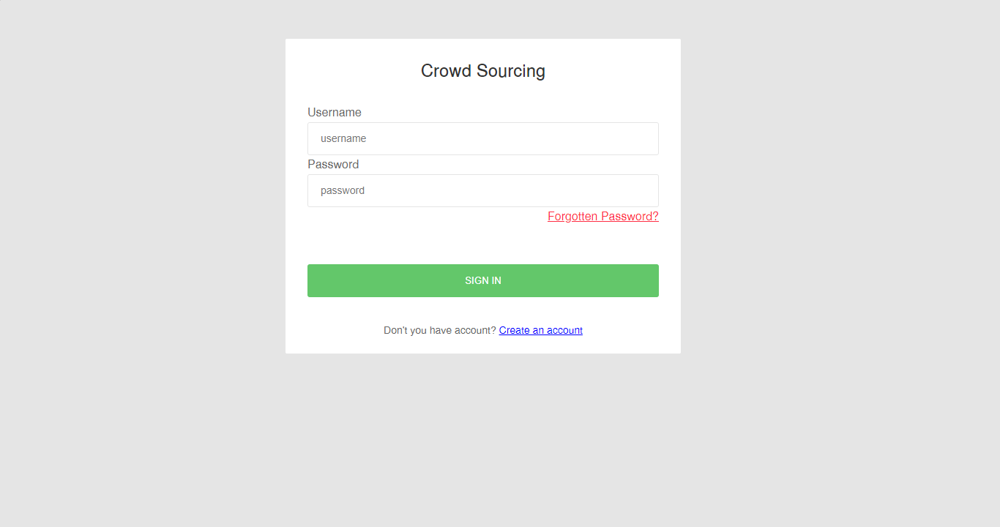
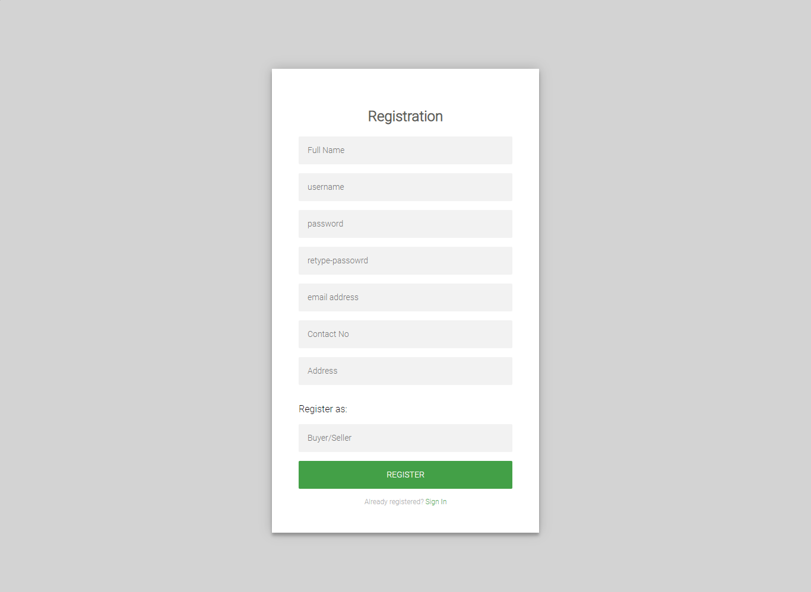
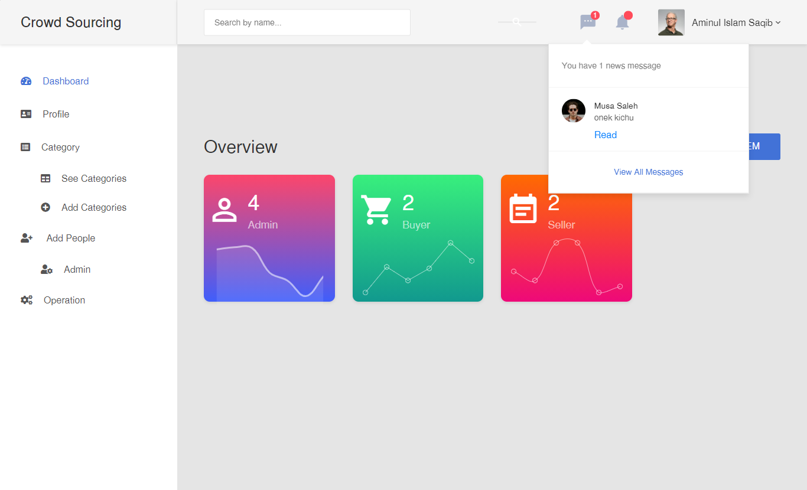
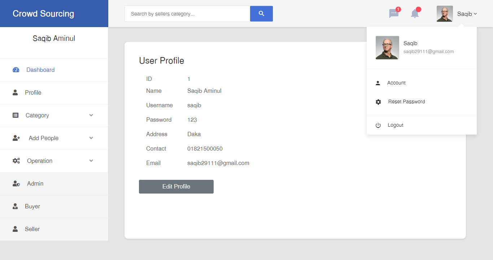
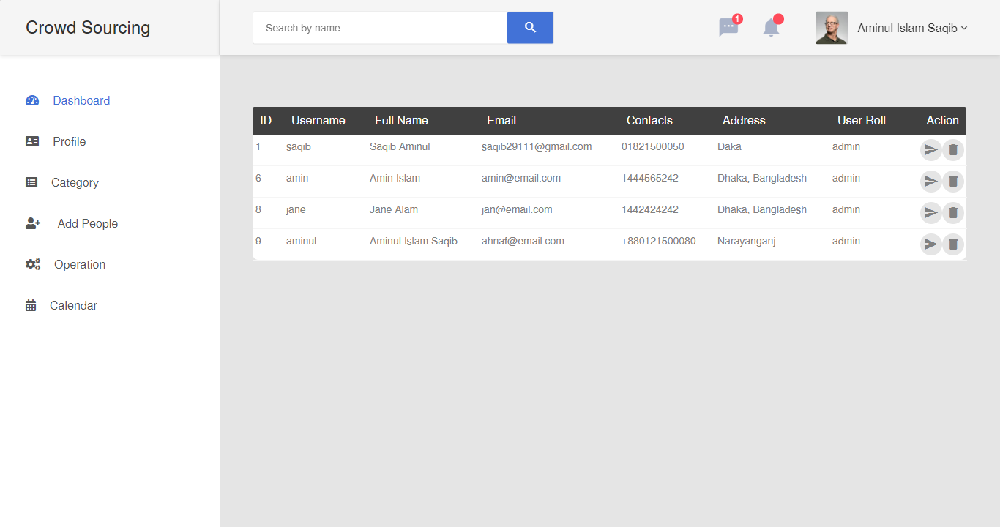
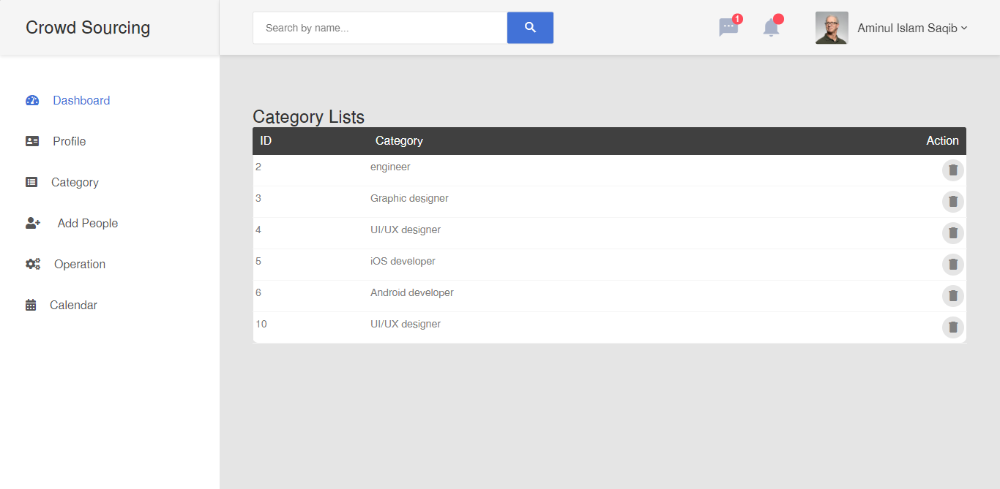

# crowdsourcing in Node JS

Simple Freelancing site project built in Node-Js as Team in Advance Programing And Web Technology course in University Spring Semester.

Technology used - **Express Js**, **MySql**

_Snapshots:

